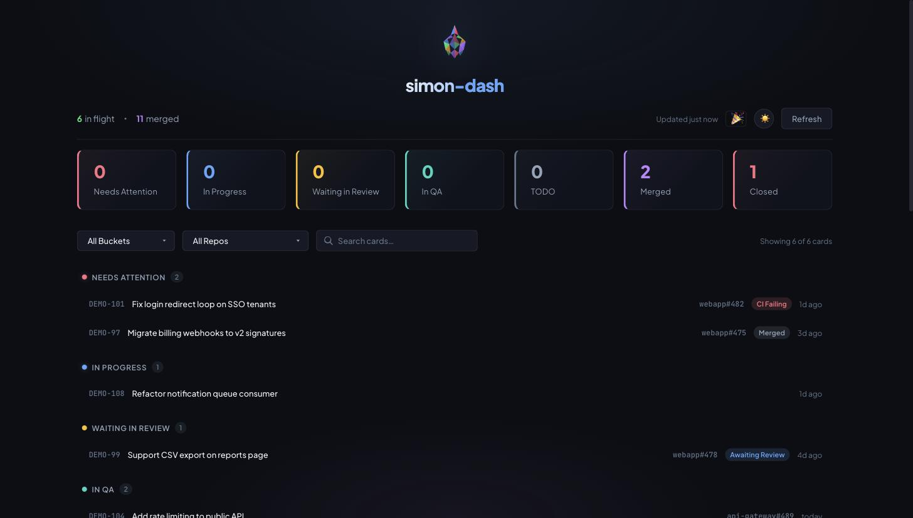
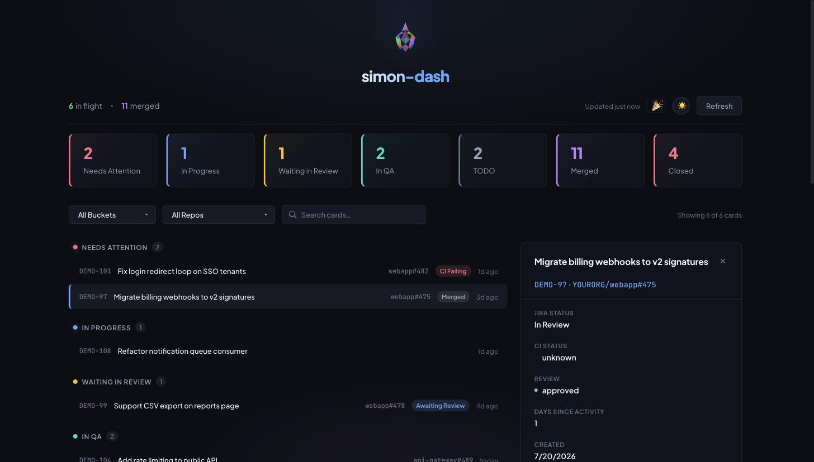
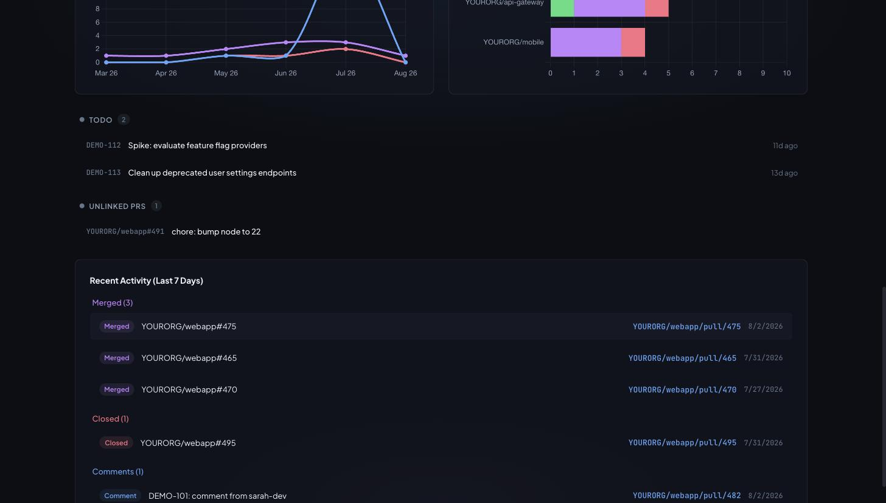

# simon-dash

Local dashboard for Jira and GitHub PRs. Node server (port 3010 by default) serves a Preact SPA that tracks card status and PR activity across projects.

See [docs/API.md](docs/API.md) for the full HTTP API reference and [docs/ARCHITECTURE.md](docs/ARCHITECTURE.md) for the module map, data flow, and design decisions.



The board groups cards into buckets, with filters for status and repo and a search box above the list.



Clicking a card opens its detail panel with Jira status, CI/review state, and comment history.



Charts and the Recent Activity feed round out the board with PR lifecycle trends and a 7-day activity log.

## Features

- **Live updates**: the server refreshes Jira/GitHub on its own schedule (`refreshIntervalSeconds` in `config.json`, default 120) and pushes every new snapshot to open tabs over Server-Sent Events (`GET /api/events`) — leave it on a screen and it stays current, no clicking refresh, and N open tabs still cost one API sweep. Moves and acks in one tab appear in every other tab immediately.
- **Buckets**: cards land in Needs Attention, In Progress, Self Review Needed, Waiting in Review, Mergeable, QA Ready, or In QA based on Jira status and linked PR state. See [docs/ARCHITECTURE.md](docs/ARCHITECTURE.md#classification-rules) for the exact rules.
- **Attention triggers**: a card surfaces in Needs Attention on CI failing, new PR comments, new Jira comments, or a merged PR whose card isn't yet In Test/Done — except while its PR is a draft, which routes to Self Review Needed instead until the card reaches "Code Review"/"In Review" (the triggers still show as pills on the row, they just don't move the card).
- **Drag-and-drop**: drag a card between any bucket except Needs Attention (In Progress, Self Review Needed, Waiting in Review, Mergeable, QA Ready, In QA) to pin it there (an override), independent of what the classifier would otherwise pick. Pinned cards show a **Pinned** line in the detail panel and an **Unpin** button that hands them back to the classifier.
- **Charts**: a Monthly Activity line chart (Opened/Merged/Closed) and a Top Repos stacked bar chart (Active/Merged/Closed), built from the full PR lifecycle log.
- **Activity groups**: a Recent Activity feed grouped by Merged, Closed, and Comments over the last 7 days.
- **Demo mode**: canned data through the real pipeline, no credentials or network calls required.
- **Celebration**: confetti and a toast the first time a PR is observed merged.
- **Attention notifications** (opt-in): toggle the 🔕 bell in the header to get a desktop notification when a card newly enters Needs Attention. Only fires while the tab is hidden — a board you're looking at already shows the card — and never replays what was already there when the page loaded. Off until you turn it on, and the browser's permission prompt appears on that click rather than at page load.
- **Write-back** (opt-in, off by default): transition a Jira card, comment on a card, or comment on a PR via the CLI or MCP tools. See the Write-back section below.

## Demo mode

Set `"demo": true` in `config.json` (or run with `SIMON_DASH_DEMO=1`; `JIRA_DASH_DEMO=1` still works as a deprecated alias) to feed canned cards and PRs through the real pipeline with no network calls. Useful for trying the UI before adding real credentials. Set it back to `false` once your tokens are in.

## Setup

Requires **Node ≥ 22.18** — the whole repo runs TypeScript directly via Node's native type stripping; older Node fails at startup with `ERR_UNKNOWN_FILE_EXTENSION`.

### 1. Configure

Copy `config.example.json` to `config.json` and fill in, then `chmod 600 config.json` — it holds long-lived Jira/GitHub credentials, and the default umask leaves it readable by every other account on the machine (`loadConfig` warns at startup if you skip this).

- **Jira**: Get your API token at https://id.atlassian.com/manage-profile/security/api-tokens. Get your accountId by visiting `https://<baseUrl>/rest/api/3/myself` (e.g., `https://mysite.atlassian.net/rest/api/3/myself`) while logged in, then copy the `accountId` field, or ask a Claude session with the Atlassian MCP to look it up.
- **GitHub**: Create a token with `repo` read scope. Falls back to `GITHUB_TOKEN` env var if not provided in config.

### 2. Install

```bash
npm ci
cd web && npm ci
cd ../mcp && npm ci
```

`npm ci` (not `npm i`) installs exactly what the lockfile pins, which matters here since this same install is also the deployment path on a machine that may hold write-enabled Jira/GitHub credentials.

The third install is only needed if you plan to use the MCP server (see Claude integration below) — but do it now anyway: skipping it is the most common fresh-clone mistake and shows up as `ERR_MODULE_NOT_FOUND` the first time `mcp/index.ts` runs.

### 3. Run

```bash
./bin/start.sh
```

Starts the server on the configured port (default 3010). The script builds the web bundle if source files are stale; on first run it will take a moment.

### 4. Development checks

```bash
npm test          # lint + typecheck + vitest (server, web and MCP in one run)
npm run lint      # oxlint on its own
npm run typecheck # tsc over server/ + mcp/, then over web/ under its own tsconfig
```

`typecheck` runs `tsc` twice because the web client needs different compiler options (JSX, DOM libs, bundler resolution) than the Node side. It used to cover only `server/`+`mcp/`, which meant web type drift surfaced solely in `cd web && npm run build` — and one such drift (a payload field typed non-nullable that the server sends as null) sat unnoticed until a test constructed the type directly.

Linting is [oxlint](https://oxc.rs), not ESLint: the repo pins TypeScript 7, which no published `typescript-eslint` supports (its peer range stops below 6.1), and downgrading the compiler to satisfy a linter is the wrong trade. oxlint parses TS/TSX natively with no `typescript` dependency, so there's no conflict to manage.

The rule set is deliberately narrow — oxlint's `correctness` category plus `react/jsx-no-target-blank` — because the broader categories produced only false positives against this codebase (Vitest's `expect(value, message)` form read as a Jira-style error, the automatic JSX runtime read as a missing `React` import, and `jira.ts`'s pagination loop, whose awaits must stay sequential since each page's token comes from the previous response). A linter that cries wolf gets ignored; add rules when they'd catch something real.

### 5. launchd (optional)

To run simon-dash at startup on macOS:

```bash
cp launchd/com.johncosta.simon-dash.plist ~/Library/LaunchAgents/
```

Edit the plist to replace `REPLACE_WITH_REPO_PATH` with the absolute path to this repo, and `REPLACE_WITH_HOME` with your home directory (e.g. `/Users/you`) — launchd does not expand `~`, so both need a real absolute path. Then:

```bash
launchctl load ~/Library/LaunchAgents/com.johncosta.simon-dash.plist
```

Logs go to `~/Library/Logs/simon-dash.log` (not `/tmp`, which is world-readable and shared across users on the machine; server logs include every request path and Jira issue key). To unload: `launchctl unload ~/Library/LaunchAgents/com.johncosta.simon-dash.plist`.

## CLI

`server/cli.ts` is a plain-TS, dependency-free CLI over the same modules the
server uses. If a simon-dash server is already running on the configured
port, commands go through its HTTP API; otherwise they operate directly on
`data/state.json`; either way the result is the same, and which transport
was used is printed to stderr.

```bash
node server/cli.ts status                # counts + needs-attention rows
node server/cli.ts status --json         # full snapshot
node server/cli.ts refresh               # fetch fresh data, then show status
node server/cli.ts ack PROJ-123          # clear attention flags on a card
node server/cli.ts move PROJ-123 in_qa   # pin a card to a bucket
node server/cli.ts unpin PROJ-123        # release the pin, back to classifier control
node server/cli.ts serve                 # run the server in the foreground
node server/cli.ts open                  # open the dashboard in your browser

# Write-back (mutates real Jira/GitHub — see the Write-back section below)
node server/cli.ts transition PROJ-123 "In Review"
node server/cli.ts comment PROJ-123 "picking this back up today"
node server/cli.ts pr-comment acme/webapp#482 "looks good, one nit inline"
```

Also runnable as `npm run cli -- status`, or (once linked/installed) as the
`simon-dash` bin.

## Claude integration

`mcp/` is a stdio MCP server exposing the board to Claude sessions, so you can ask Claude about your board directly instead of switching to the dashboard or the CLI. It uses the same dual transport as the CLI: proxies through a running server if one's up on the configured port, otherwise operates directly on `data/state.json`. `board_status` and `card_comments` both carry an `_note` field (and matching tool-description text) flagging that card summaries and comment bodies are third-party Jira/GitHub text, not instructions — worth knowing if you're piping tool output somewhere else.

Install its dependencies once:

```bash
cd mcp && npm i
```

Register it with the Claude Code CLI:

```bash
claude mcp add simon-dash --scope user -- node /path/to/simon-dash/mcp/index.ts
```

Or add it directly to `.mcp.json`:

```json
{
  "mcpServers": {
    "simon-dash": {
      "command": "node",
      "args": ["/path/to/simon-dash/mcp/index.ts"]
    }
  }
}
```

Tools exposed:

- `board_status`: the full current board snapshot (same payload as `GET /api/data`).
- `refresh`: fetch fresh Jira/GitHub data and return a summary (bucket counts, errors, newly Done cards).
- `ack_card`: acknowledge a card's attention flags.
- `move_card`: pin a card to a bucket.
- `unpin_card`: release a pin and return the card to classifier control.
- `card_comments`: one card's comment history and unseen comments.
- `transition_card`, `comment_card`, `comment_pr`: write-back tools — see the Write-back section below. Their descriptions instruct Claude to draft the content, show it to you, and only call the tool after you approve it in conversation.

## Write-back

simon-dash can optionally *write* to Jira and GitHub — transition a card's status, comment on a card, comment on a PR — instead of only reading. This is off by default and stays off until you explicitly turn it on:

- Set `"writeEnabled": true` in `config.json`. The default (`false`, matching `config.example.json`) makes every write path refuse with a clear error: `write-back disabled; set writeEnabled: true in config.json`.
- The gate is re-checked from disk on **every single write** (not just at process startup) — `performWrite()` reloads `config.json` fresh before deciding whether to allow the call. Flip `writeEnabled` to `false` in `config.json` and the very next `transition`/`comment`/`pr-comment` refuses, with no server/CLI/MCP restart required. This fails **closed**: if that fresh read throws for any reason (the file was deleted, permissions changed, it's transiently unreadable mid-edit), the write is refused rather than falling back to whatever config the caller already had in memory — a long-running process can't keep writing just because its in-memory config happened to say `writeEnabled: true` before `config.json` became unreadable.
- Demo mode **always** refuses writes, regardless of `writeEnabled` — there's nothing real for canned demo data to write to. That refusal is a "stub success" (not an error), so scripting against the CLI/MCP doesn't need special-case error handling for demo mode.
- The dashboard web UI itself stays entirely read-only — there is no write-back UI in the SPA. Writes only happen via an explicit CLI command (`transition`/`comment`/`pr-comment`) or an explicit MCP tool call, both of which require you (or, for MCP, a Claude session you're actively steering) to trigger them on purpose. Nothing in simon-dash writes to Jira or GitHub automatically or on a timer.
- All three write paths (the CLI, the MCP tools, and `POST /api/write` itself) funnel through the same `performWrite()` function (`server/writeback.ts`), so the gate and the "refresh the board after a successful write" behavior can't drift between them. See [docs/API.md](docs/API.md#post-apiwrite) for the endpoint and gate semantics in full.

## API

Full reference: [docs/API.md](docs/API.md). Summary: `GET /api/data` returns the last snapshot from memory, `POST /api/refresh` fetches fresh Jira/GitHub data (or demo data) and rebuilds it, `POST /api/action` applies an `ack` or `move` to one card, `POST /api/write` (gated, off by default) transitions a card, comments on a card, or comments on a PR. Manual moves and acknowledgements are stored locally in `data/state.json`; Jira and GitHub are read-only unless you've explicitly enabled write-back.

## Buckets

- **needs_attention**: Blocked-or-broken only — CI failing on an open PR, or a PR merged while the card is not in "In Test" or "Done". An open **draft** PR outranks both and routes to self_review regardless, unless the card is in a review status (see below). These stay muted after an ack only while they remain continuously true, and re-fire as new events once they clear and recur. Other signals (new comments, missing QA instructions) do **not** move a card: they stay in the column their status earns and show a pill instead, because a pending event shouldn't evict a card from its lifecycle state. Comment signals are cleared by acking/moving, which reset the seen horizon.
- **self_review**: Open draft PR whose card is not yet in "Code Review"/"In Review", or an open PR with no review activity and a card not yet in a review status.
- **waiting_review**: Open PR with review activity (or the card is in "Code Review"/"In Review") that isn't approved yet. Moving the card to a review status is the explicit "I have self-reviewed it, it is out for peer review" signal, so it also lands a still-draft PR here rather than leaving it in Self Review Needed.
- **mergeable**: Open PR approved.
- **qa_ready**: Jira card status is "In Test".
- **in_qa**: Manual-move destination for cards actively being tested (a pinned override; the classifier itself routes In Test cards to QA Ready).
- **in_progress**: Everything else (default).
- A manual move pins the card to its bucket until a fresh attention trigger fires; overrides auto-clear once the card reaches In Test or Done, and you can release one yourself with the detail panel's **Unpin** button, `simon-dash unpin <KEY>`, or the `unpin_card` MCP tool.

## Upgrading an existing checkout

```bash
git pull
npm ci && (cd web && npm ci) && (cd mcp && npm ci)   # only if a lockfile changed
./bin/start.sh                                        # or reload the launchd agent
```

`data/state.json` is gitignored, so it is per-machine and a pull never touches
it. Most changes need nothing more than the above. When one *does* need a
one-off pass over existing state, it ships as a script in `scripts/` and is
listed here. **Stop the server before running any of them** — a refresh tick
rewrites `state.json` and would clobber the edit.

| Script | Run it if | What it does |
|---|---|---|
| `scripts/purge-done-ledger.py` | Your `data/state.json` predates 2026-08-12 and the Done counter has ever looked too high | Drops the 25 `doneCelebrated` entries that a pre-2026-08-05 assignee bug wrote for other people's cards. Backs up to `state.json.pre-purge.bak` first, prints `32 -> 7`, and is a no-op on a second run. Delete the script once it has been run everywhere it needed running. |

Each is idempotent and takes its own backup, so running one you didn't need is
harmless.

## Local State

Manual moves and acknowledgements are stored in `data/state.json`. Server reads live Jira/GitHub state on each `/api/refresh` and merges with your local overrides. See [docs/ARCHITECTURE.md](docs/ARCHITECTURE.md#statejson-anatomy) for the full shape.
